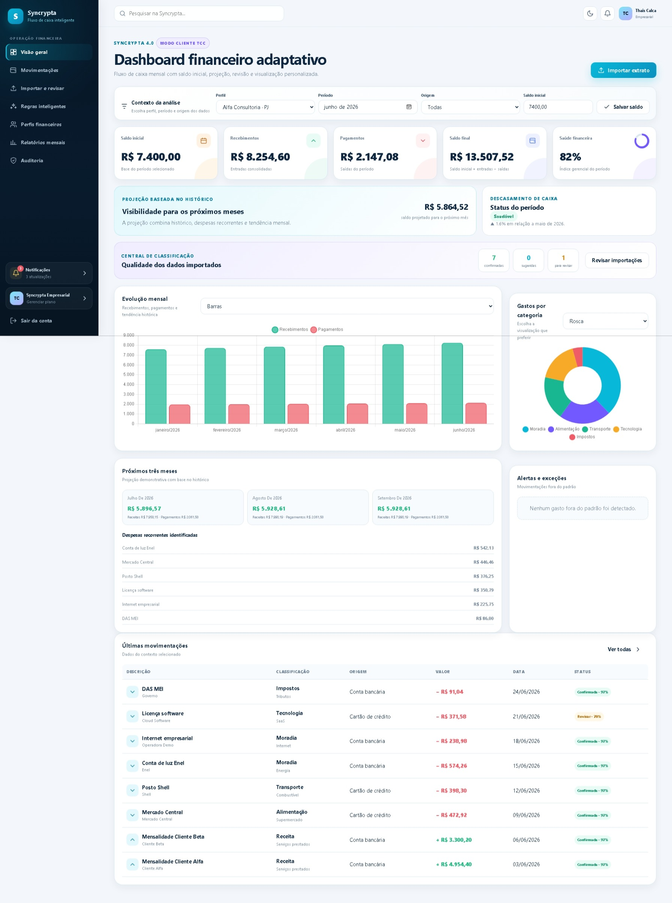
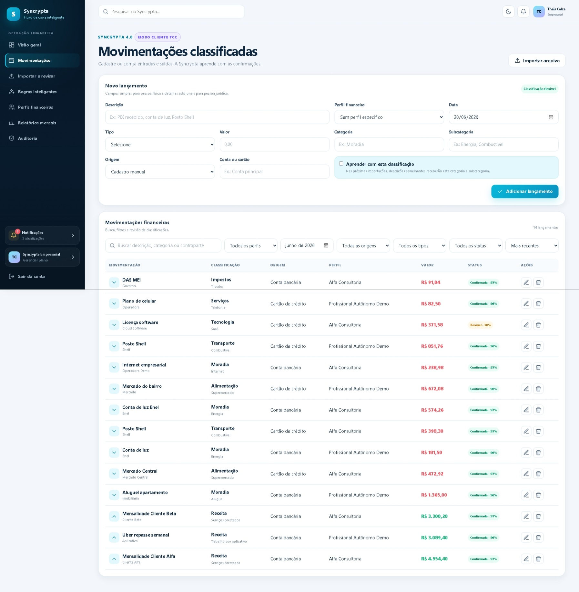
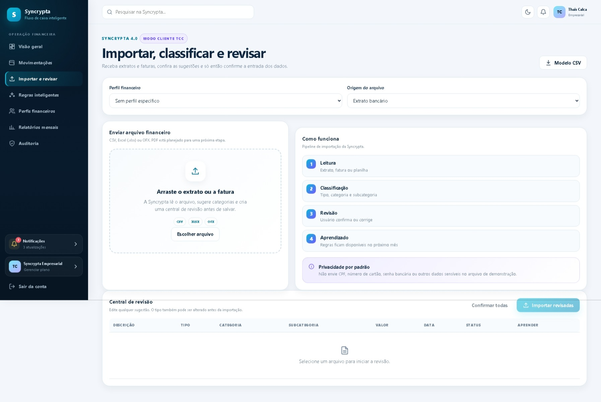
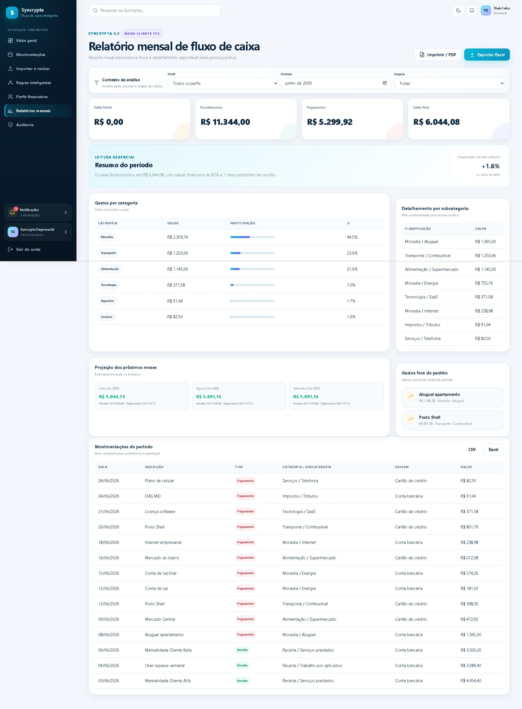
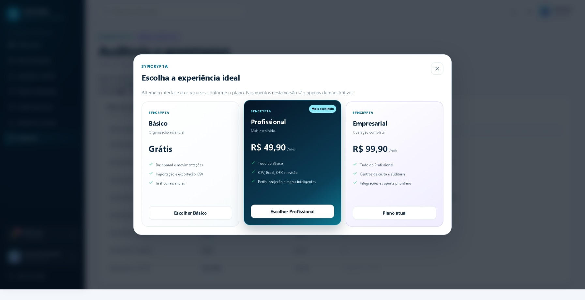

# Syncrypta 4.0.2 Premium Final

**Contabilidade inteligente. Segurança real.**

A **Syncrypta** é uma plataforma acadêmica de controle inteligente de fluxo de caixa desenvolvida para o TCC da **FIAP School**, a partir do desafio apresentado pela profissional de contabilidade **Thais Calca**.

A proposta não é substituir um ERP, um sistema contábil completo ou o Power BI. A Syncrypta atua em uma etapa anterior e essencial: receber dados financeiros, organizar movimentações, classificar lançamentos, permitir correções e transformar essas informações em uma visão mensal simples, visual e útil para a tomada de decisão.

> **Projeto demonstrativo:** nenhuma cobrança real é realizada, nenhuma conta bancária é conectada e todos os dados utilizados na apresentação são fictícios.

---

## Visão geral da solução

```text
Extrato bancário, fatura ou planilha
↓
Leitura e validação dos lançamentos
↓
Separação entre recebimentos e pagamentos
↓
Classificação por categoria e subcategoria
↓
Central de revisão do usuário
↓
Correção e aprendizado de regras personalizadas
↓
Dashboard e relatório mensal de fluxo de caixa
```

A plataforma foi desenvolvida para atender diferentes perfis:

- **Pessoa física:** experiência mais simples, visual e acessível pelo celular.
- **Pessoa jurídica:** maior detalhamento, filtros, centros de custo, contas, classificações e exportações.

---

## Imagens do sistema

### Dashboard financeiro adaptativo



---

### Movimentações classificadas



---

### Importação, classificação e revisão



---

### Relatório mensal de fluxo de caixa



---

### Planos da plataforma



---

## Funcionalidades principais

### Interface e experiência

- Landing page premium apresentando a solução;
- Login e cadastro redesenhados;
- Tema claro e escuro;
- Sidebar moderna e responsiva;
- Interface adaptada para computador, tablet e celular;
- Conta especial para demonstração do TCC;
- Alteração da interface conforme o plano selecionado.

### Dashboard financeiro

O dashboard apresenta:

- saldo inicial;
- total de recebimentos;
- total de pagamentos;
- saldo final;
- saúde financeira;
- descasamento de caixa;
- comparação com o mês anterior;
- projeção dos próximos três meses;
- despesas recorrentes;
- gastos fora do padrão;
- qualidade dos dados importados;
- últimas movimentações;
- gráficos mensais e por categoria;
- escolha entre gráficos de barras, linhas, pizza e rosca.

A fórmula principal utilizada é:

```text
Saldo final = saldo inicial + recebimentos − pagamentos
```

### Perfis financeiros

A plataforma permite criar perfis para diferentes contextos, como:

- pessoa física;
- profissional autônomo;
- empresa;
- cliente de escritório contábil;
- unidade ou centro de custo.

Os filtros podem considerar:

- perfil financeiro;
- mês;
- origem;
- conta ou cartão;
- tipo da movimentação;
- status da classificação.

### Movimentações

As movimentações possuem:

- descrição;
- tipo: receita ou pagamento;
- valor;
- data;
- categoria;
- subcategoria;
- origem;
- conta ou cartão;
- contraparte;
- centro de custo;
- natureza do gasto;
- perfil financeiro;
- nível de confiança da classificação;
- status de confirmação ou revisão.

Também estão disponíveis:

- cadastro manual;
- busca;
- filtros;
- ordenação;
- edição;
- exclusão;
- aprendizado com a classificação escolhida.

### Importação financeira

A Syncrypta permite importar:

- arquivos CSV;
- planilhas Excel `.xlsx`;
- arquivos OFX.

Durante a importação, o sistema:

1. lê o arquivo;
2. identifica receitas e pagamentos;
3. sugere categorias e subcategorias;
4. calcula um nível de confiança;
5. envia itens incertos para revisão;
6. permite corrigir o tipo e a classificação;
7. salva regras para lançamentos semelhantes.

### Central de revisão

Antes de confirmar uma importação, o usuário pode:

- alterar o tipo da movimentação;
- alterar a categoria;
- alterar a subcategoria;
- confirmar sugestões;
- identificar itens não classificados;
- escolher se a correção deverá gerar uma nova regra.

### Regras inteligentes

Exemplos de regras:

```text
Contém "Shell"
→ Transporte / Combustível

Contém "Enel"
→ Moradia / Energia

Contém "Mercado"
→ Alimentação / Supermercado
```

Quando o usuário corrige uma classificação e permite o aprendizado, a regra fica disponível para futuras importações.

> O aprendizado demonstrado é baseado em regras e histórico de correções. Não utiliza um modelo externo de inteligência artificial treinado.

### Relatórios mensais

Os relatórios apresentam:

- saldo inicial;
- recebimentos;
- pagamentos;
- saldo final;
- resumo gerencial;
- comparação com o mês anterior;
- gastos por categoria;
- gastos por subcategoria;
- gastos fora do padrão;
- projeção dos próximos meses;
- lista completa das movimentações;
- exportação CSV;
- exportação Excel;
- impressão e geração de PDF pelo navegador.

### Gestão e controle

- Gestão de perfis financeiros;
- Auditoria de ações;
- Histórico de alterações;
- Notificações inteligentes;
- Alertas diferentes para pessoa física e pessoa jurídica;
- Controle de recursos por plano;
- Checkout demonstrativo;
- Ativação demonstrativa de planos.

---

## Planos

| Recurso | Básico | Profissional | Empresarial |
|---|:---:|:---:|:---:|
| Dashboard e movimentações | Sim | Sim | Sim |
| Importação e exportação CSV | Sim | Sim | Sim |
| Excel e OFX | Não | Sim | Sim |
| Central de revisão | Não | Sim | Sim |
| Regras inteligentes | Não | Sim | Sim |
| Projeção financeira | Não | Sim | Sim |
| Perfis financeiros | Não | Sim | Sim |
| Centros de custo | Não | Não | Sim |
| Auditoria avançada | Não | Não | Sim |
| Recursos empresariais | Não | Não | Sim |

Os pagamentos são apenas demonstrativos e não geram cobranças reais.

---

## Formatos de entrada

| Formato | Situação |
|---|---|
| CSV | Funcional |
| Excel `.xlsx` | Funcional pela primeira aba |
| OFX | Funcional para lançamentos bancários básicos |
| PDF | Planejado para uma etapa futura |

A pasta `arquivos_teste` contém exemplos prontos para apresentação.

---

## Contas demonstrativas

### Cliente TCC

```text
E-mail: thais.demo@syncrypta.local
Senha: Syncrypta@2026
```

Essa conta:

- começa no plano Empresarial;
- possui dados financeiros fictícios;
- possui perfis de pessoa física e jurídica;
- possui regras de classificação;
- possui saldos iniciais;
- possui registros de auditoria;
- pode alternar livremente entre os planos;
- não precisa realizar pagamento;
- muda a interface conforme o plano selecionado.

### Usuário comum

```text
E-mail: demo@syncrypta.local
Senha: Demo@2026
```

Essa conta:

- começa no plano Básico;
- permite testar as limitações dos planos;
- permite acessar o checkout demonstrativo;
- pode ativar planos por PIX ou cartão simulados.

> O telefone pessoal informado durante o desenvolvimento não foi incluído no código, nos dados de teste ou nas credenciais.

---

## Tecnologias utilizadas

### Front-end

- HTML5;
- CSS3;
- JavaScript;
- Chart.js;
- interface responsiva;
- Local Storage e Session Storage para controle da sessão no navegador.

### Back-end

- Node.js;
- Express;
- bcryptjs;
- JSON Web Token;
- Helmet;
- express-rate-limit;
- CORS;
- dotenv;
- armazenamento demonstrativo em arquivos JSON.

### Ferramentas

- Visual Studio Code;
- Live Server;
- Git;
- GitHub;
- npm.

---

## Pré-requisitos

Para executar o projeto, é necessário instalar:

- Node.js LTS;
- npm;
- Visual Studio Code;
- extensão Live Server.

---

## Como executar

### 1. Baixar o projeto

Clique em:

```text
Code → Download ZIP
```

Extraia o arquivo e abra a pasta no Visual Studio Code.

### 2. Abrir o terminal na pasta do backend

```bash
cd backend
```

### 3. Instalar as dependências

```bash
npm install --no-audit --no-fund
```

No Windows PowerShell, caso o comando `npm` seja bloqueado pela política de execução, use:

```powershell
npm.cmd install --no-audit --no-fund
```

### 4. Criar os dados demonstrativos

```bash
npm run seed
```

No PowerShell:

```powershell
npm.cmd run seed
```

Esse comando recria os usuários, movimentações, perfis, regras, saldos e registros demonstrativos.

### 5. Iniciar o backend

```bash
npm start
```

No PowerShell:

```powershell
npm.cmd start
```

O terminal deverá mostrar:

```text
Syncrypta 4.0 disponível em http://localhost:3000
```

Mantenha esse terminal aberto enquanto utilizar o sistema.

### 6. Abrir o site

No Visual Studio Code:

1. localize o arquivo `index.html`;
2. clique com o botão direito;
3. selecione **Open with Live Server**.

O site será aberto em um endereço semelhante a:

```text
http://127.0.0.1:5500/index.html
```

### Próximas execuções

Depois que as dependências e os dados já tiverem sido criados, basta executar:

```powershell
cd backend
npm.cmd start
```

Depois abra novamente o `index.html` com o Live Server.

---

## Atalhos para Windows

O projeto também possui:

```text
1_PREPARAR_DEMO.bat
2_INICIAR_BACKEND.bat
```

- `1_PREPARAR_DEMO.bat`: instala as dependências e cria os dados demonstrativos;
- `2_INICIAR_BACKEND.bat`: inicia o servidor.

---

## Arquivos de teste

```text
arquivos_teste/
├── extrato_teste.csv
├── extrato_teste.xlsx
├── extrato_teste.ofx
└── LEIA-ME.txt
```

Esses arquivos podem ser utilizados na página **Importar e revisar**.

---

## Estrutura do projeto

```text
Syncrypta-TCC-Criacao-Site/
├── backend/
│   ├── config/
│   │   └── planos.js
│   ├── auditoria.json
│   ├── clientes.json
│   ├── movimentacoes.json
│   ├── pagamentos.json
│   ├── regras.json
│   ├── saldos.json
│   ├── usuarios.json
│   ├── .env.example
│   ├── package.json
│   ├── package-lock.json
│   ├── seed-demo.js
│   └── server.js
├── arquivos_teste/
│   ├── extrato_teste.csv
│   ├── extrato_teste.xlsx
│   ├── extrato_teste.ofx
│   └── LEIA-ME.txt
├── imagens/
│   ├── dashboard.jpeg
│   ├── movimentacoes.jpeg
│   ├── importacao.jpeg
│   ├── relatorios.jpeg
│   └── planos.jpeg
├── vendor/
│   └── chart.umd.js
├── index.html
├── login.html
├── cadastro.html
├── dashboard.html
├── movimentacoes.html
├── importacao.html
├── regras.html
├── clientes.html
├── relatorios.html
├── auditoria.html
├── checkout.html
├── script.js
├── style.css
├── CHANGELOG_V4.md
├── GUIA_DE_INSTALACAO_E_APRESENTACAO.md
├── VERSION.txt
└── README.md
```

---

## Privacidade e segurança

A Syncrypta evita o cadastro de informações como:

- CPF;
- CNPJ;
- número completo do cartão;
- CVV;
- senha bancária;
- credenciais financeiras reais.

O projeto demonstra:

- hash de senhas com bcrypt;
- autenticação JWT;
- rotas protegidas;
- limite de tentativas de login;
- cabeçalhos de segurança com Helmet;
- separação de informações por usuário;
- controle de recursos por plano;
- auditoria de operações;
- arquivo `.env.example` sem segredo real;
- dados fictícios para demonstração.

Para uma versão de produção ainda seriam necessários:

- banco de dados gerenciado;
- HTTPS;
- backups;
- recuperação de conta;
- consentimento;
- política de privacidade;
- adequação completa à LGPD;
- provedor real de pagamentos;
- testes automatizados;
- testes de segurança;
- monitoramento e logs em servidor.

---

## Limitações conhecidas

- arquivos PDF ainda não são interpretados automaticamente;
- o leitor de Excel trabalha com a primeira aba;
- o parser OFX cobre os campos mais comuns;
- pagamentos são simulados;
- nenhuma integração bancária real é realizada;
- projeções são demonstrativas e baseadas em médias e recorrência;
- não existe um modelo de inteligência artificial externo treinado;
- o armazenamento em JSON é adequado para apresentação, mas não para produção.

---

## Integrantes

- **Tales Oliveira Campos** — RM 13222
- **Kenny Koixun Navarrete Yang** — RM 14356
- **Pedro Henrique Tourino Marconni** — RM 16082
- **Lucas Rezende Rino** — RM 16444
- **Vinicius Ettore Almeida Souza** — RM 16320
- **Henrique de Paula Corredor** — RM 16365

---

## Status do projeto

**Syncrypta 4.0.2 Premium Final**

Projeto preparado para:

- testes;
- demonstração;
- apresentação do TCC;
- refinamentos finais até outubro de 2026.

---

## Aviso acadêmico

Este projeto foi desenvolvido exclusivamente para fins educacionais e demonstrativos no contexto do TCC da FIAP School.
