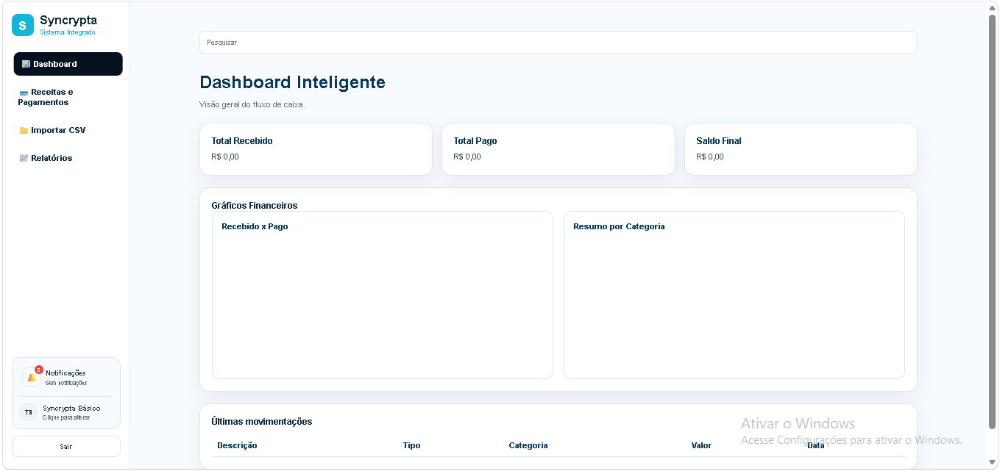

# Syncrypta

**Contabilidade inteligente. Segurança real.**

A Syncrypta é uma plataforma web de controle inteligente de fluxo de caixa, criada como projeto de TCC da FIAP School.

O sistema permite cadastrar e importar movimentações financeiras, separar receitas e pagamentos, gerar dashboards e produzir relatórios de forma simples e visual.

---

## Sobre o projeto

A Syncrypta foi desenvolvida a partir do desafio apresentado pela contadora **Thais Calca**.

A proposta busca resolver dificuldades relacionadas ao controle manual de movimentações financeiras, classificação de receitas e despesas e geração de relatórios de fluxo de caixa.

---

## Funcionalidades

* Cadastro e login de usuários
* Autenticação com senha criptografada
* Cadastro de receitas e pagamentos
* Edição e exclusão de movimentações
* Importação de arquivos CSV
* Dashboard financeiro
* Total recebido, total pago e saldo final
* Gráficos financeiros
* Resumo por categoria
* Exportação de relatório em CSV
* Seleção de planos Básico, Profissional e Empresarial
* Sistema de notificações
* Interface responsiva

---

## Tecnologias utilizadas

### Front-end

* HTML5
* CSS3
* JavaScript
* Chart.js

### Back-end

* Node.js
* Express
* JSON Web Token
* bcryptjs
* CORS

### Armazenamento

* Arquivos JSON para usuários e movimentações

---

## Estrutura do projeto

```text
Syncrypta-TCC-Criacao-Site/
├── backend/
│   ├── server.js
│   ├── usuarios.json
│   ├── movimentacoes.json
│   ├── package.json
│   └── package-lock.json
├── index.html
├── cadastro.html
├── login.html
├── dashboard.html
├── movimentacoes.html
├── importacao.html
├── relatorios.html
├── script.js
├── style.css
└── README.md
```

---

## Como executar

### 1. Instale as dependências

Abra o terminal dentro da pasta `backend`:

```bash
npm install
```

### 2. Inicie o servidor

```bash
node server.js
```

O backend será executado em:

```text
http://localhost:3000
```

### 3. Abra o site

Abra o arquivo `index.html` utilizando a extensão Live Server do Visual Studio Code.

---

## Formato do arquivo CSV

O arquivo de importação deve seguir este modelo:

```csv
Descricao,Tipo,Categoria,Valor,Data
PIX Cliente,receita,Receita,1200,2026-06-01
Mercado Extra,pagamento,Alimentação,150,2026-06-02
```

---

## Imagens do sistema

Adicione nesta seção imagens da página inicial, dashboard, movimentações, importação e relatórios.

Exemplo:

```markdown

```

---

## Integrantes

* Tales Oliveira Campos — RM 13222
* Kenny Koixun Navarrete Yang — RM 14356
* Pedro Henrique Tourino Marconni — RM 16082
* Lucas Rezende Rino — RM 16444
* Vinicius Ettore Almeida Souza — RM 16320
* Henrique de Paula Corredor — RM 16365

---

## Status do projeto

Projeto em desenvolvimento para o Trabalho de Conclusão de Curso da FIAP School.

Principais funcionalidades de cadastro, autenticação, movimentações financeiras, dashboard, gráficos, importação e exportação já implementadas.

---

## Objetivo

Simplificar o controle financeiro de pessoas, profissionais e empresas por meio de uma plataforma acessível, organizada e visual.
